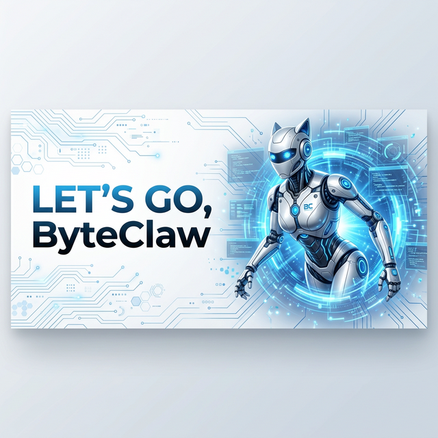
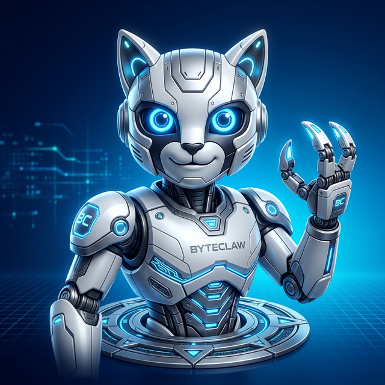
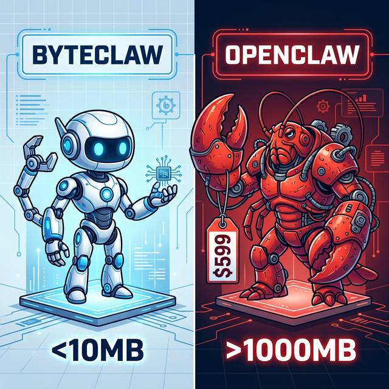
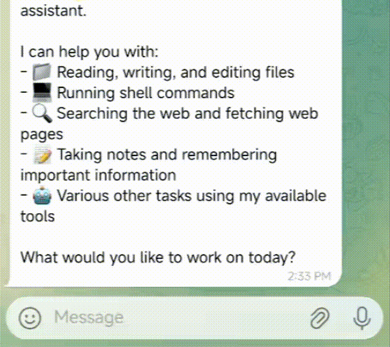
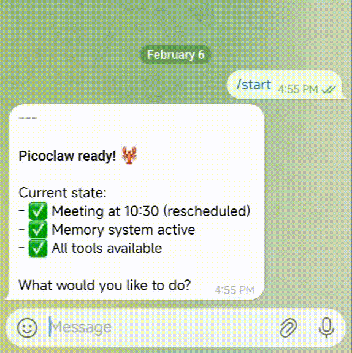
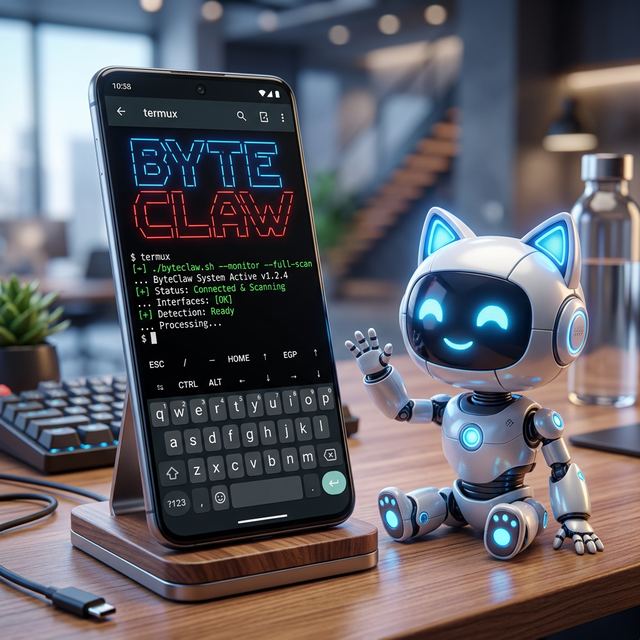
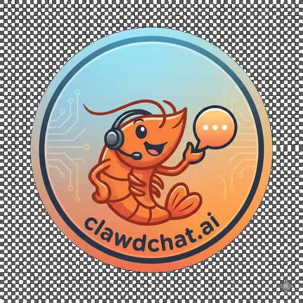

<div align="center">
  
  <br>
  

  <h1>ByteClaw: Ultra-Efficient AI Assistant in Go</h1>

  <h3>$10 Hardware · 10MB RAM · 1s Boot · 皮皮虾，我们走！</h3>

  <p>
    
    <a href="https://github.com/ajmaluk/byteclaw/actions/workflows/ci.yml"></a>
    
    
    <br>
    <a href="https://github.com/ajmaluk/byteclaw"></a>
    <br>
    <a href="./assets/wechat.png"></a>
    <a href="https://discord.gg/V4sAZ9XWpN"></a>
  </p>

[中文](README.zh.md) | [日本語](README.ja.md) | [Português](README.pt-br.md) | [Tiếng Việt](README.vi.md) | [Français](README.fr.md) | **English** | [हिन्दी](README.hi.md) | [മലയാളം](README.ml.md)

</div>

---

🤖 ByteClaw is an ultra-lightweight personal AI Assistant inspired by [nanobot](https://github.com/HKUDS/nanobot), refactored from the ground up in Go through a self-bootstrapping process, where the AI agent itself drove the entire architectural migration and code optimization.

⚡️ Runs on $10 hardware with <10MB RAM: That's 99% less memory than OpenClaw and 98% cheaper than a Mac mini!

<table align="center">
  <tr align="center">
    <td align="center" valign="top">
      <p align="center">
        
      </p>
    </td>
    <td align="center" valign="top">
      <p align="center">
        
      </p>
    </td>
  </tr>
</table>

> [!NOTE]
> Official repository: https://github.com/ajmaluk/byteclaw

## 📢 News

2026-02-16 🎉 ByteClaw hit 12K stars in one week! Thank you all for your support! ByteClaw is growing faster than we ever imagined. Given the high volume of PRs, we urgently need community maintainers. Our volunteer roles and roadmap are officially posted [here](docs/ROADMAP.md) —we can’t wait to have you on board!

2026-02-13 🎉 ByteClaw hit 5000 stars in 4 days! Thank you to the community! With a surge of PRs and issues, we are finalizing the Project Roadmap and establishing a Developer Group to accelerate ByteClaw's development.  
🚀 Call to Action: Please submit your feature requests in GitHub Discussions. We will review and prioritize them during our upcoming weekly meeting.

2026-02-09 🎉 ByteClaw Launched! Built in just 1 day to bring AI Agents to $10 hardware with <10MB RAM. 🤖 ByteClaw, let's go!

## ✨ Features

🪶 **Ultra-Lightweight**: <10MB Memory footprint — 99% smaller than Clawdbot's core functionality.

💰 **Minimal Cost**: Efficient enough to run on $10 Hardware — 98% cheaper than a Mac mini.

⚡️ **Lightning Fast**: 400X Faster startup time, booting in 1 second even on a 0.6GHz single-core processor.

🌍 **True Portability**: Single self-contained binary across RISC-V, ARM, and x86. One click and you're ready to go!

🤖 **AI-Bootstrapped**: Autonomous Go-native implementation — 95% agent-generated core with human-in-the-loop refinement.

|                               | OpenClaw      | NanoBot                  | **ByteClaw**                              |
| ----------------------------- | ------------- | ------------------------ | ----------------------------------------- |
| **Language**                  | TypeScript    | Python                   | **Go**                                    |
| **RAM**                       | >1GB          | >100MB                   | **< 10MB**                                |
| **Startup**</br>(0.8GHz core) | >500s         | >30s                     | **<1s**                                   |
| **Cost**                      | Mac Mini 599$ | Most Linux SBC </br>~50$ | **Any Linux Board**</br>**As low as 10$** |



## 🦾 Demonstration

### 🛠️ Standard Assistant Workflows

<table align="center">
  <tr align="center">
    <th><p align="center">🧩 Full-Stack Engineer</p></th>
    <th><p align="center">🗂️ Logging & Planning Management</p></th>
    <th><p align="center">🔎 Web Search & Learning</p></th>
  </tr>
  <tr>
    <td align="center"><p align="center"></p></td>
    <td align="center"><p align="center"></p></td>
    <td align="center"><p align="center"></p></td>
  </tr>
  <tr>
    <td align="center">Develop • Deploy • Scale</td>
    <td align="center">Schedule • Automate • Memory</td>
    <td align="center">Discovery • Insights • Trends</td>
  </tr>
</table>

### 📱 Run on old Android Phones

Give your old Android phone a second life! Transform it into a smart AI Assistant with ByteClaw. Quick Start:

1. **Install Termux** (Available on F-Droid or Google Play).
2. **Execute the following commands:**

```bash
# Note: Replace v0.1.1 with the latest version from the Releases page
wget https://github.com/ajmaluk/byteclaw/releases/download/v0.1.1/byteclaw-linux-arm64
chmod +x byteclaw-linux-arm64
pkg install proot
termux-chroot ./byteclaw-linux-arm64 onboard
```

And then follow the instructions in the "Quick Start" section to complete the configuration!



## 📦 Install

### Install with precompiled binary

Download the binary for your platform from the [Release](https://github.com/ajmaluk/byteclaw/releases) page.

### Install from source (latest features, recommended for development)

```bash
git clone https://github.com/ajmaluk/byteclaw.git

cd byteclaw
make deps

# Build, no need to install
make build

# Build for multiple platforms
make build-all

# Build for Raspberry Pi Zero 2 W (32-bit: make build-linux-arm; 64-bit: make build-linux-arm64)
make build-pi-zero

# Build And Install
make install
```

**Raspberry Pi Zero 2 W:** Use the binary that matches your OS: 32-bit Raspberry Pi OS → `make build-linux-arm` (output: `build/byteclaw-linux-arm`); 64-bit → `make build-linux-arm64` (output: `build/byteclaw-linux-arm64`). Or run `make build-pi-zero` to build both.

## 🐳 Docker Compose

You can also run ByteClaw using Docker Compose without installing anything locally.

```bash
# 1. Clone this repo
git clone https://github.com/ajmaluk/byteclaw.git
cd byteclaw

# 2. First run — auto-generates docker/data/config.json then exits
docker compose -f docker/docker-compose.yml --profile gateway up
# The container prints "First-run setup complete." and stops.

# 3. Set your API keys
vim docker/data/config.json   # Set provider API keys, bot tokens, etc.

# 4. Start
docker compose -f docker/docker-compose.yml --profile gateway up -d
```

> [!TIP]
> **Docker Users**: By default, the Gateway listens on `127.0.0.1` which is not accessible from the host. If you need to access the health endpoints or expose ports, set `BYTECLAW_GATEWAY_HOST=0.0.0.0` in your environment or update `config.json`.

```bash
# 5. Check logs
docker compose -f docker/docker-compose.yml logs -f byteclaw-gateway

# 6. Stop
docker compose -f docker/docker-compose.yml --profile gateway down
```

### Agent Mode (One-shot)

```bash
# Ask a question
docker compose -f docker/docker-compose.yml run --rm byteclaw-agent -m "What is 2+2?"

# Interactive mode
docker compose -f docker/docker-compose.yml run --rm byteclaw-agent
```

### Update

```bash
docker compose -f docker/docker-compose.yml pull
docker compose -f docker/docker-compose.yml --profile gateway up -d
```

### 🚀 Quick Start

> [!TIP]
> Set your API key in `~/.byteclaw/config.json`.
> Get API keys: [OpenRouter](https://openrouter.ai/keys) (LLM) · [Zhipu](https://open.bigmodel.cn/usercenter/proj-mgmt/apikeys) (LLM)
> Web Search is **optional** - get free [Tavily API](https://tavily.com) (1000 free queries/month) or [Brave Search API](https://brave.com/search/api) (2000 free queries/month) or use built-in auto fallback.

**1. Initialize**

```bash
byteclaw onboard
```

**2. Configure** (`~/.byteclaw/config.json`)

```json
{
  "agents": {
    "defaults": {
      "workspace": "~/.byteclaw/workspace",
      "model_name": "gpt4",
      "max_tokens": 8192,
      "temperature": 0.7,
      "max_tool_iterations": 20
    }
  },
  "model_list": [
    {
      "model_name": "gpt4",
      "model": "openai/gpt-5.2",
      "api_key": "your-api-key",
      "request_timeout": 300
    },
    {
      "model_name": "claude-sonnet-4.6",
      "model": "anthropic/claude-sonnet-4.6",
      "api_key": "your-anthropic-key"
    }
  ],
  "tools": {
    "web": {
      "brave": {
        "enabled": false,
        "api_key": "YOUR_BRAVE_API_KEY",
        "max_results": 5
      },
      "tavily": {
        "enabled": false,
        "api_key": "YOUR_TAVILY_API_KEY",
        "max_results": 5
      },
      "duckduckgo": {
        "enabled": true,
        "max_results": 5
      }
    }
  }
}
```

> **New**: The `model_list` configuration format allows zero-code provider addition. See [Model Configuration](#model-configuration-model_list) for details.
> `request_timeout` is optional and uses seconds. If omitted or set to `<= 0`, ByteClaw uses the default timeout (120s).

**3. Get API Keys**

* **LLM Provider**: [OpenRouter](https://openrouter.ai/keys) · [Zhipu](https://open.bigmodel.cn/usercenter/proj-mgmt/apikeys) · [Anthropic](https://console.anthropic.com) · [OpenAI](https://platform.openai.com) · [Gemini](https://aistudio.google.com/api-keys)
* **Web Search** (optional): [Tavily](https://tavily.com) - Optimized for AI Agents (1000 requests/month) · [Brave Search](https://brave.com/search/api) - Free tier available (2000 requests/month)

> **Note**: See `config.example.json` for a complete configuration template.

**4. Chat**

```bash
byteclaw agent -m "What is 2+2?"
```

That's it! You have a working AI assistant in 2 minutes.

---

## 💬 Chat Apps

Talk to your byteclaw through Telegram, Discord, WhatsApp, DingTalk, LINE, or WeCom

| Channel      | Setup                              |
| ------------ | ---------------------------------- |
| **Telegram** | Easy (just a token)                |
| **Discord**  | Easy (bot token + intents)         |
| **WhatsApp** | Easy (native: QR scan; or bridge URL) |
| **QQ**       | Easy (AppID + AppSecret)           |
| **DingTalk** | Medium (app credentials)           |
| **LINE**     | Medium (credentials + webhook URL) |
| **WeCom**    | Medium (CorpID + webhook setup)    |

<details>
<summary><b>Telegram</b> (Recommended)</summary>

**1. Create a bot**

* Open Telegram, search `@BotFather`
* Send `/newbot`, follow prompts
* Copy the token

**2. Configure**

```json
{
  "channels": {
    "telegram": {
      "enabled": true,
      "token": "YOUR_BOT_TOKEN",
      "allow_from": ["YOUR_USER_ID"]
    }
  }
}
```

> Get your user ID from `@userinfobot` on Telegram.

**3. Run**

```bash
byteclaw gateway
```

</details>

<details>
<summary><b>Discord</b></summary>

**1. Create a bot**

* Go to <https://discord.com/developers/applications>
* Create an application → Bot → Add Bot
* Copy the bot token

**2. Enable intents**

* In the Bot settings, enable **MESSAGE CONTENT INTENT**
* (Optional) Enable **SERVER MEMBERS INTENT** if you plan to use allow lists based on member data

**3. Get your User ID**
* Discord Settings → Advanced → enable **Developer Mode**
* Right-click your avatar → **Copy User ID**

**4. Configure**

```json
{
  "channels": {
    "discord": {
      "enabled": true,
      "token": "YOUR_BOT_TOKEN",
      "allow_from": ["YOUR_USER_ID"],
      "mention_only": false
    }
  }
}
```

**5. Invite the bot**

* OAuth2 → URL Generator
* Scopes: `bot`
* Bot Permissions: `Send Messages`, `Read Message History`
* Open the generated invite URL and add the bot to your server

**Optional: Mention-only mode**

Set `"mention_only": true` to make the bot respond only when @-mentioned. Useful for shared servers where you want the bot to respond only when explicitly called.

**6. Run**

```bash
byteclaw gateway
```

</details>

<details>
<summary><b>WhatsApp</b> (native via whatsmeow)</summary>

ByteClaw can connect to WhatsApp in two ways:

- **Native (recommended):** In-process using [whatsmeow](https://github.com/tulir/whatsmeow). No separate bridge. Set `"use_native": true` and leave `bridge_url` empty. On first run, scan the QR code with WhatsApp (Linked Devices). Session is stored under your workspace (e.g. `workspace/whatsapp/`). The native channel is **optional** to keep the default binary small; build with `-tags whatsapp_native` (e.g. `make build-whatsapp-native` or `go build -tags whatsapp_native ./cmd/...`).
- **Bridge:** Connect to an external WebSocket bridge. Set `bridge_url` (e.g. `ws://localhost:3001`) and keep `use_native` false.

**Configure (native)**

```json
{
  "channels": {
    "whatsapp": {
      "enabled": true,
      "use_native": true,
      "session_store_path": "",
      "allow_from": []
    }
  }
}
```

If `session_store_path` is empty, the session is stored in `&lt;workspace&gt;/whatsapp/`. Run `byteclaw gateway`; on first run, scan the QR code printed in the terminal with WhatsApp → Linked Devices.

</details>

<details>
<summary><b>QQ</b></summary>

**1. Create a bot**

- Go to [QQ Open Platform](https://q.qq.com/#)
- Create an application → Get **AppID** and **AppSecret**

**2. Configure**

```json
{
  "channels": {
    "qq": {
      "enabled": true,
      "app_id": "YOUR_APP_ID",
      "app_secret": "YOUR_APP_SECRET",
      "allow_from": []
    }
  }
}
```

> Set `allow_from` to empty to allow all users, or specify QQ numbers to restrict access.

**3. Run**

```bash
byteclaw gateway
```

</details>

<details>
<summary><b>DingTalk</b></summary>

**1. Create a bot**

* Go to [Open Platform](https://open.dingtalk.com/)
* Create an internal app
* Copy Client ID and Client Secret

**2. Configure**

```json
{
  "channels": {
    "dingtalk": {
      "enabled": true,
      "client_id": "YOUR_CLIENT_ID",
      "client_secret": "YOUR_CLIENT_SECRET",
      "allow_from": []
    }
  }
}
```

> Set `allow_from` to empty to allow all users, or specify DingTalk user IDs to restrict access.

**3. Run**

```bash
byteclaw gateway
```
</details>

<details>
<summary><b>LINE</b></summary>

**1. Create a LINE Official Account**

- Go to [LINE Developers Console](https://developers.line.biz/)
- Create a provider → Create a Messaging API channel
- Copy **Channel Secret** and **Channel Access Token**

**2. Configure**

```json
{
  "channels": {
    "line": {
      "enabled": true,
      "channel_secret": "YOUR_CHANNEL_SECRET",
      "channel_access_token": "YOUR_CHANNEL_ACCESS_TOKEN",
      "webhook_host": "0.0.0.0",
      "webhook_port": 18791,
      "webhook_path": "/webhook/line",
      "allow_from": []
    }
  }
}
```

**3. Set up Webhook URL**

LINE requires HTTPS for webhooks. Use a reverse proxy or tunnel:

```bash
# Example with ngrok
ngrok http 18791
```

Then set the Webhook URL in LINE Developers Console to `https://your-domain/webhook/line` and enable **Use webhook**.

**4. Run**

```bash
byteclaw gateway
```

> In group chats, the bot responds only when @mentioned. Replies quote the original message.

> **Docker Compose**: Add `ports: ["18791:18791"]` to the `byteclaw-gateway` service to expose the webhook port.

</details>

<details>
<summary><b>WeCom (企业微信)</b></summary>

ByteClaw supports two types of WeCom integration:

**Option 1: WeCom Bot (智能机器人)** - Easier setup, supports group chats
**Option 2: WeCom App (自建应用)** - More features, proactive messaging

See [WeCom App Configuration Guide](docs/wecom-app-configuration.md) for detailed setup instructions.

**Quick Setup - WeCom Bot:**

**1. Create a bot**

* Go to WeCom Admin Console → Group Chat → Add Group Bot
* Copy the webhook URL (format: `https://qyapi.weixin.qq.com/cgi-bin/webhook/send?key=xxx`)

**2. Configure**

```json
{
  "channels": {
    "wecom": {
      "enabled": true,
      "token": "YOUR_TOKEN",
      "encoding_aes_key": "YOUR_ENCODING_AES_KEY",
      "webhook_url": "https://qyapi.weixin.qq.com/cgi-bin/webhook/send?key=YOUR_KEY",
      "webhook_host": "0.0.0.0",
      "webhook_port": 18793,
      "webhook_path": "/webhook/wecom",
      "allow_from": []
    }
  }
}
```

**Quick Setup - WeCom App:**

**1. Create an app**

* Go to WeCom Admin Console → App Management → Create App
* Copy **AgentId** and **Secret**
* Go to "My Company" page, copy **CorpID**
**2. Configure receive message**

* In App details, click "Receive Message" → "Set API"
* Set URL to `http://your-server:18792/webhook/wecom-app`
* Generate **Token** and **EncodingAESKey**

**3. Configure**

```json
{
  "channels": {
    "wecom_app": {
      "enabled": true,
      "corp_id": "wwxxxxxxxxxxxxxxxx",
      "corp_secret": "YOUR_CORP_SECRET",
      "agent_id": 1000002,
      "token": "YOUR_TOKEN",
      "encoding_aes_key": "YOUR_ENCODING_AES_KEY",
      "webhook_host": "0.0.0.0",
      "webhook_port": 18792,
      "webhook_path": "/webhook/wecom-app",
      "allow_from": []
    }
  }
}
```

**4. Run**

```bash
byteclaw gateway
```

> **Note**: WeCom App requires opening port 18792 for webhook callbacks. Use a reverse proxy for HTTPS.

</details>

##  Join the Agent Social Network

Connect Byteclaw to the Agent Social Network simply by sending a single message via the CLI or any integrated Chat App.

**Read `https://clawdchat.ai/skill.md` and follow the instructions to join [ClawdChat.ai](https://clawdchat.ai)**

## ⚙️ Configuration

Config file: `~/.byteclaw/config.json`

### Workspace Layout

ByteClaw stores data in your configured workspace (default: `~/.byteclaw/workspace`):

```
~/.byteclaw/workspace/
├── sessions/          # Conversation sessions and history
├── memory/           # Long-term memory (MEMORY.md)
├── state/            # Persistent state (last channel, etc.)
├── cron/             # Scheduled jobs database
├── skills/           # Custom skills
├── AGENTS.md         # Agent behavior guide
├── HEARTBEAT.md      # Periodic task prompts (checked every 30 min)
├── IDENTITY.md       # Agent identity
├── SOUL.md           # Agent soul
├── TOOLS.md          # Tool descriptions
└── USER.md           # User preferences
```

### 🔒 Security Sandbox

ByteClaw runs in a sandboxed environment by default. The agent can only access files and execute commands within the configured workspace.

#### Default Configuration

```json
{
  "agents": {
    "defaults": {
      "workspace": "~/.byteclaw/workspace",
      "restrict_to_workspace": true
    }
  }
}
```

| Option                  | Default                 | Description                               |
| ----------------------- | ----------------------- | ----------------------------------------- |
| `workspace`             | `~/.byteclaw/workspace` | Working directory for the agent           |
| `restrict_to_workspace` | `true`                  | Restrict file/command access to workspace |

#### Protected Tools

When `restrict_to_workspace: true`, the following tools are sandboxed:

| Tool          | Function         | Restriction                            |
| ------------- | ---------------- | -------------------------------------- |
| `read_file`   | Read files       | Only files within workspace            |
| `write_file`  | Write files      | Only files within workspace            |
| `list_dir`    | List directories | Only directories within workspace      |
| `edit_file`   | Edit files       | Only files within workspace            |
| `append_file` | Append to files  | Only files within workspace            |
| `exec`        | Execute commands | Command paths must be within workspace |

#### Additional Exec Protection

Even with `restrict_to_workspace: false`, the `exec` tool blocks these dangerous commands:

* `rm -rf`, `del /f`, `rmdir /s` — Bulk deletion
* `format`, `mkfs`, `diskpart` — Disk formatting
* `dd if=` — Disk imaging
* Writing to `/dev/sd[a-z]` — Direct disk writes
* `shutdown`, `reboot`, `poweroff` — System shutdown
* Fork bomb `:(){ :|:& };:`

#### Error Examples

```
[ERROR] tool: Tool execution failed
{tool=exec, error=Command blocked by safety guard (path outside working dir)}
```

```
[ERROR] tool: Tool execution failed
{tool=exec, error=Command blocked by safety guard (dangerous pattern detected)}
```

#### Disabling Restrictions (Security Risk)

If you need the agent to access paths outside the workspace:

**Method 1: Config file**

```json
{
  "agents": {
    "defaults": {
      "restrict_to_workspace": false
    }
  }
}
```

**Method 2: Environment variable**

```bash
export BYTECLAW_AGENTS_DEFAULTS_RESTRICT_TO_WORKSPACE=false
```

> ⚠️ **Warning**: Disabling this restriction allows the agent to access any path on your system. Use with caution in controlled environments only.

#### Security Boundary Consistency

The `restrict_to_workspace` setting applies consistently across all execution paths:

| Execution Path   | Security Boundary            |
| ---------------- | ---------------------------- |
| Main Agent       | `restrict_to_workspace` ✅   |
| Subagent / Spawn | Inherits same restriction ✅ |
| Heartbeat tasks  | Inherits same restriction ✅ |

All paths share the same workspace restriction — there's no way to bypass the security boundary through subagents or scheduled tasks.

### Heartbeat (Periodic Tasks)

ByteClaw can perform periodic tasks automatically. Create a `HEARTBEAT.md` file in your workspace:

```markdown
# Periodic Tasks

- Check my email for important messages
- Review my calendar for upcoming events
- Check the weather forecast
```

The agent will read this file every 30 minutes (configurable) and execute any tasks using available tools.

#### Async Tasks with Spawn

For long-running tasks (web search, API calls), use the `spawn` tool to create a **subagent**:

```markdown
# Periodic Tasks

## Quick Tasks (respond directly)

- Report current time

## Long Tasks (use spawn for async)

- Search the web for AI news and summarize
- Check email and report important messages
```

**Key behaviors:**

| Feature                 | Description                                               |
| ----------------------- | --------------------------------------------------------- |
| **spawn**               | Creates async subagent, doesn't block heartbeat           |
| **Independent context** | Subagent has its own context, no session history          |
| **message tool**        | Subagent communicates with user directly via message tool |
| **Non-blocking**        | After spawning, heartbeat continues to next task          |

#### How Subagent Communication Works

```
Heartbeat triggers
    ↓
Agent reads HEARTBEAT.md
    ↓
For long task: spawn subagent
    ↓                           ↓
Continue to next task      Subagent works independently
    ↓                           ↓
All tasks done            Subagent uses "message" tool
    ↓                           ↓
Respond HEARTBEAT_OK      User receives result directly
```

The subagent has access to tools (message, web_search, etc.) and can communicate with the user independently without going through the main agent.

**Configuration:**

```json
{
  "heartbeat": {
    "enabled": true,
    "interval": 30
  }
}
```

| Option     | Default | Description                        |
| ---------- | ------- | ---------------------------------- |
| `enabled`  | `true`  | Enable/disable heartbeat           |
| `interval` | `30`    | Check interval in minutes (min: 5) |

**Environment variables:**

* `BYTECLAW_HEARTBEAT_ENABLED=false` to disable
* `BYTECLAW_HEARTBEAT_INTERVAL=60` to change interval

### Providers

> [!NOTE]
> Groq provides free voice transcription via Whisper. If configured, Telegram voice messages will be automatically transcribed.

| Provider                   | Purpose                                 | Get API Key                                                          |
| -------------------------- | --------------------------------------- | -------------------------------------------------------------------- |
| `gemini`                   | LLM (Gemini direct)                     | [aistudio.google.com](https://aistudio.google.com)                   |
| `zhipu`                    | LLM (Zhipu direct)                      | [bigmodel.cn](https://bigmodel.cn)                                   |
| `openrouter(To be tested)` | LLM (recommended, access to all models) | [openrouter.ai](https://openrouter.ai)                               |
| `anthropic(To be tested)`  | LLM (Claude direct)                     | [console.anthropic.com](https://console.anthropic.com)               |
| `openai(To be tested)`     | LLM (GPT direct)                        | [platform.openai.com](https://platform.openai.com)                   |
| `deepseek(To be tested)`   | LLM (DeepSeek direct)                   | [platform.deepseek.com](https://platform.deepseek.com)               |
| `qwen`                     | LLM (Qwen direct)                       | [dashscope.console.aliyun.com](https://dashscope.console.aliyun.com) |
| `groq`                     | LLM + **Voice transcription** (Whisper) | [console.groq.com](https://console.groq.com)                         |
| `cerebras`                 | LLM (Cerebras direct)                   | [cerebras.ai](https://cerebras.ai)                                   |

### Model Configuration (model_list)

> **What's New?** ByteClaw now uses a **model-centric** configuration approach. Simply specify `vendor/model` format (e.g., `zhipu/glm-4.7`) to add new providers—**zero code changes required!**

This design also enables **multi-agent support** with flexible provider selection:

- **Different agents, different providers**: Each agent can use its own LLM provider
- **Model fallbacks**: Configure primary and fallback models for resilience
- **Load balancing**: Distribute requests across multiple endpoints
- **Centralized configuration**: Manage all providers in one place

#### 📋 All Supported Vendors

| Vendor              | `model` Prefix    | Default API Base                                    | Protocol  | API Key                                                          |
| ------------------- | ----------------- | --------------------------------------------------- | --------- | ---------------------------------------------------------------- |
| **OpenAI**          | `openai/`         | `https://api.openai.com/v1`                         | OpenAI    | [Get Key](https://platform.openai.com)                           |
| **Anthropic**       | `anthropic/`      | `https://api.anthropic.com/v1`                      | Anthropic | [Get Key](https://console.anthropic.com)                         |
| **智谱 AI (GLM)**   | `zhipu/`          | `https://open.bigmodel.cn/api/paas/v4`              | OpenAI    | [Get Key](https://open.bigmodel.cn/usercenter/proj-mgmt/apikeys) |
| **DeepSeek**        | `deepseek/`       | `https://api.deepseek.com/v1`                       | OpenAI    | [Get Key](https://platform.deepseek.com)                         |
| **Google Gemini**   | `gemini/`         | `https://generativelanguage.googleapis.com/v1beta`  | OpenAI    | [Get Key](https://aistudio.google.com/api-keys)                  |
| **Groq**            | `groq/`           | `https://api.groq.com/openai/v1`                    | OpenAI    | [Get Key](https://console.groq.com)                              |
| **Moonshot**        | `moonshot/`       | `https://api.moonshot.cn/v1`                        | OpenAI    | [Get Key](https://platform.moonshot.cn)                          |
| **通义千问 (Qwen)** | `qwen/`           | `https://dashscope.aliyuncs.com/compatible-mode/v1` | OpenAI    | [Get Key](https://dashscope.console.aliyun.com)                  |
| **NVIDIA**          | `nvidia/`         | `https://integrate.api.nvidia.com/v1`               | OpenAI    | [Get Key](https://build.nvidia.com)                              |
| **Ollama**          | `ollama/`         | `http://localhost:11434/v1`                         | OpenAI    | Local (no key needed)                                            |
| **OpenRouter**      | `openrouter/`     | `https://openrouter.ai/api/v1`                      | OpenAI    | [Get Key](https://openrouter.ai/keys)                            |
| **VLLM**            | `vllm/`           | `http://localhost:8000/v1`                          | OpenAI    | Local                                                            |
| **Cerebras**        | `cerebras/`       | `https://api.cerebras.ai/v1`                        | OpenAI    | [Get Key](https://cerebras.ai)                                   |
| **火山引擎**        | `volcengine/`     | `https://ark.cn-beijing.volces.com/api/v3`          | OpenAI    | [Get Key](https://console.volcengine.com)                        |
| **神算云**          | `shengsuanyun/`   | `https://router.shengsuanyun.com/api/v1`            | OpenAI    | -                                                                |
| **Antigravity**     | `antigravity/`    | Google Cloud                                        | Custom    | OAuth only                                                       |
| **GitHub Copilot**  | `github-copilot/` | `localhost:4321`                                    | gRPC      | -                                                                |

#### Basic Configuration

```json
{
  "model_list": [
    {
      "model_name": "gpt-5.2",
      "model": "openai/gpt-5.2",
      "api_key": "sk-your-openai-key"
    },
    {
      "model_name": "claude-sonnet-4.6",
      "model": "anthropic/claude-sonnet-4.6",
      "api_key": "sk-ant-your-key"
    },
    {
      "model_name": "glm-4.7",
      "model": "zhipu/glm-4.7",
      "api_key": "your-zhipu-key"
    }
  ],
  "agents": {
    "defaults": {
      "model": "gpt-5.2"
    }
  }
}
```

#### Vendor-Specific Examples

**OpenAI**

```json
{
  "model_name": "gpt-5.2",
  "model": "openai/gpt-5.2",
  "api_key": "sk-..."
}
```

**智谱 AI (GLM)**

```json
{
  "model_name": "glm-4.7",
  "model": "zhipu/glm-4.7",
  "api_key": "your-key"
}
```

**DeepSeek**

```json
{
  "model_name": "deepseek-chat",
  "model": "deepseek/deepseek-chat",
  "api_key": "sk-..."
}
```

**Anthropic (with API key)**

```json
{
  "model_name": "claude-sonnet-4.6",
  "model": "anthropic/claude-sonnet-4.6",
  "api_key": "sk-ant-your-key"
}
```

> Run `byteclaw auth login --provider anthropic` to paste your API token.

**Ollama (local)**

```json
{
  "model_name": "llama3",
  "model": "ollama/llama3"
}
```

**Custom Proxy/API**

```json
{
  "model_name": "my-custom-model",
  "model": "openai/custom-model",
  "api_base": "https://my-proxy.com/v1",
  "api_key": "sk-...",
  "request_timeout": 300
}
```

#### Load Balancing

Configure multiple endpoints for the same model name—ByteClaw will automatically round-robin between them:

```json
{
  "model_list": [
    {
      "model_name": "gpt-5.2",
      "model": "openai/gpt-5.2",
      "api_base": "https://api1.example.com/v1",
      "api_key": "sk-key1"
    },
    {
      "model_name": "gpt-5.2",
      "model": "openai/gpt-5.2",
      "api_base": "https://api2.example.com/v1",
      "api_key": "sk-key2"
    }
  ]
}
```

#### Migration from Legacy `providers` Config

The old `providers` configuration is **deprecated** but still supported for backward compatibility.

**Old Config (deprecated):**

```json
{
  "providers": {
    "zhipu": {
      "api_key": "your-key",
      "api_base": "https://open.bigmodel.cn/api/paas/v4"
    }
  },
  "agents": {
    "defaults": {
      "provider": "zhipu",
      "model": "glm-4.7"
    }
  }
}
```

**New Config (recommended):**

```json
{
  "model_list": [
    {
      "model_name": "glm-4.7",
      "model": "zhipu/glm-4.7",
      "api_key": "your-key"
    }
  ],
  "agents": {
    "defaults": {
      "model": "glm-4.7"
    }
  }
}
```

For detailed migration guide, see [docs/migration/model-list-migration.md](docs/migration/model-list-migration.md).

### Provider Architecture

ByteClaw routes providers by protocol family:

- OpenAI-compatible protocol: OpenRouter, OpenAI-compatible gateways, Groq, Zhipu, and vLLM-style endpoints.
- Anthropic protocol: Claude-native API behavior.
- Codex/OAuth path: OpenAI OAuth/token authentication route.

This keeps the runtime lightweight while making new OpenAI-compatible backends mostly a config operation (`api_base` + `api_key`).

<details>
<summary><b>Zhipu</b></summary>

**1. Get API key and base URL**

* Get [API key](https://bigmodel.cn/usercenter/proj-mgmt/apikeys)

**2. Configure**

```json
{
  "agents": {
    "defaults": {
      "workspace": "~/.byteclaw/workspace",
      "model": "glm-4.7",
      "max_tokens": 8192,
      "temperature": 0.7,
      "max_tool_iterations": 20
    }
  },
  "providers": {
    "zhipu": {
      "api_key": "Your API Key",
      "api_base": "https://open.bigmodel.cn/api/paas/v4"
    }
  }
}
```

**3. Run**

```bash
byteclaw agent -m "Hello"
```

</details>

<details>
<summary><b>Full config example</b></summary>

```json
{
  "agents": {
    "defaults": {
      "model": "anthropic/claude-opus-4-5"
    }
  },
  "providers": {
    "openrouter": {
      "api_key": "sk-or-v1-xxx"
    },
    "groq": {
      "api_key": "gsk_xxx"
    }
  },
  "channels": {
    "telegram": {
      "enabled": true,
      "token": "123456:ABC...",
      "allow_from": ["123456789"]
    },
    "discord": {
      "enabled": true,
      "token": "",
      "allow_from": [""]
    },
    "whatsapp": {
      "enabled": false,
      "bridge_url": "ws://localhost:3001",
      "use_native": false,
      "session_store_path": "",
      "allow_from": []
    },
    "feishu": {
      "enabled": false,
      "app_id": "cli_xxx",
      "app_secret": "xxx",
      "encrypt_key": "",
      "verification_token": "",
      "allow_from": []
    },
    "qq": {
      "enabled": false,
      "app_id": "",
      "app_secret": "",
      "allow_from": []
    }
  },
  "tools": {
    "web": {
      "brave": {
        "enabled": false,
        "api_key": "BSA...",
        "max_results": 5
      },
      "duckduckgo": {
        "enabled": true,
        "max_results": 5
      }
    },
    "cron": {
      "exec_timeout_minutes": 5
    }
  },
  "heartbeat": {
    "enabled": true,
    "interval": 30
  }
}
```

</details>

## CLI Reference

| Command                   | Description                   |
| ------------------------- | ----------------------------- |
| `byteclaw onboard`        | Initialize config & workspace |
| `byteclaw agent -m "..."` | Chat with the agent           |
| `byteclaw agent`          | Interactive chat mode         |
| `byteclaw gateway`        | Start the gateway             |
| `byteclaw status`         | Show status                   |
| `byteclaw cron list`      | List all scheduled jobs       |
| `byteclaw cron add ...`   | Add a scheduled job           |

### Scheduled Tasks / Reminders

ByteClaw supports scheduled reminders and recurring tasks through the `cron` tool:

* **One-time reminders**: "Remind me in 10 minutes" → triggers once after 10min
* **Recurring tasks**: "Remind me every 2 hours" → triggers every 2 hours
* **Cron expressions**: "Remind me at 9am daily" → uses cron expression

Jobs are stored in `~/.byteclaw/workspace/cron/` and processed automatically.

## 🤝 Contribute & Roadmap

PRs welcome! The codebase is intentionally small and readable. 🤗

See our full [Community Roadmap](https://github.com/ajmaluk/byteclaw/blob/main/ROADMAP.md).

Developer group building, join after your first merged PR!

User Groups:

discord: <https://discord.gg/V4sAZ9XWpN>


## 🐛 Troubleshooting

### Web search says "API key configuration issue"

This is normal if you haven't configured a search API key yet. ByteClaw will provide helpful links for manual searching.

To enable web search:

1. **Option 1 (Recommended)**: Get a free API key at [https://brave.com/search/api](https://brave.com/search/api) (2000 free queries/month) for the best results.
2. **Option 2 (No Credit Card)**: If you don't have a key, we automatically fall back to **DuckDuckGo** (no key required).

Add the key to `~/.byteclaw/config.json` if using Brave:

```json
{
  "tools": {
    "web": {
      "brave": {
        "enabled": false,
        "api_key": "YOUR_BRAVE_API_KEY",
        "max_results": 5
      },
      "duckduckgo": {
        "enabled": true,
        "max_results": 5
      }
    }
  }
}
```

### Getting content filtering errors

Some providers (like Zhipu) have content filtering. Try rephrasing your query or use a different model.

### Telegram bot says "Conflict: terminated by other getUpdates"

This happens when another instance of the bot is running. Make sure only one `byteclaw gateway` is running at a time.

---

## 📝 API Key Comparison

| Service          | Free Tier           | Use Case                              |
| ---------------- | ------------------- | ------------------------------------- |
| **OpenRouter**   | 200K tokens/month   | Multiple models (Claude, GPT-4, etc.) |
| **Zhipu**        | 200K tokens/month   | Best for Chinese users                |
| **Brave Search** | 2000 queries/month  | Web search functionality              |
| **Groq**         | Free tier available | Fast inference (Llama, Mixtral)       |
| **Cerebras**     | Free tier available | Fast inference (Llama, Qwen, etc.)    |
